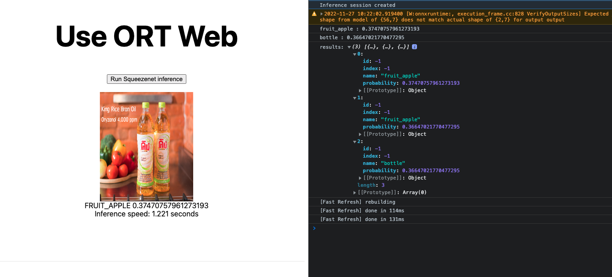

# Object detection on WebApp

Based on NextJS + ONNX Runtime



## Features

- [x] YOLOv7-tiny can detect object in random image
- [ ] Connect to webcam instead of random image
- [ ] Handle camera stream buffer
- [ ] Split object detection out from classification
- [ ] Move object detection part to OpenCV
- [ ] Render in canvas
- [ ] Draw rectangle in canvas

## Usage

```sh
npm run dev

> ort-web-template@0.1.0 dev /Users/patharanor/Projects/web-onnxruntime-nextjs
> next dev

ready - started server on 0.0.0.0:3000, url: http://localhost:3000
info  - Using webpack 5. Reason: Enabled by default https://nextjs.org/docs/messages/webpack5
event - compiled successfully
event - build page: /
wait  - compiling...
event - compiled successfully
```

## POC

> **Ref.** YOLOv7-tiny model is in `~/model`. It's testing model, just 30/300 epochs.

- YOLOv7-tiny (in `*.onnx`) :
  - [NG] Dimension 416x416 => session fail.
  - [NG] Dimension 416x416 & `executionProviders` is `webgl` => got int64 issue.
  - [NG] Dimension 416x416 + opset12 & `executionProviders` is `webgl` => got error on operator `ArgMax`.
  - [NG] Dimension 416x416 + opset13 (to 17) & `executionProviders` is `webgl` => got error on operator `Split`.
  - [NG] Dimension 640x640 & `executionProviders` is `webgl` => got int64 issue.
  - [NG] Dimension 640x640 + opset12 & `executionProviders` is `webgl` => got error on operator `ArgMax`.
  - [NG] Dimension 640x640 + opset13 (to 17) & `executionProviders` is `webgl` => got error on operator `Split`.
  - [OK] Dimension 640x640.
